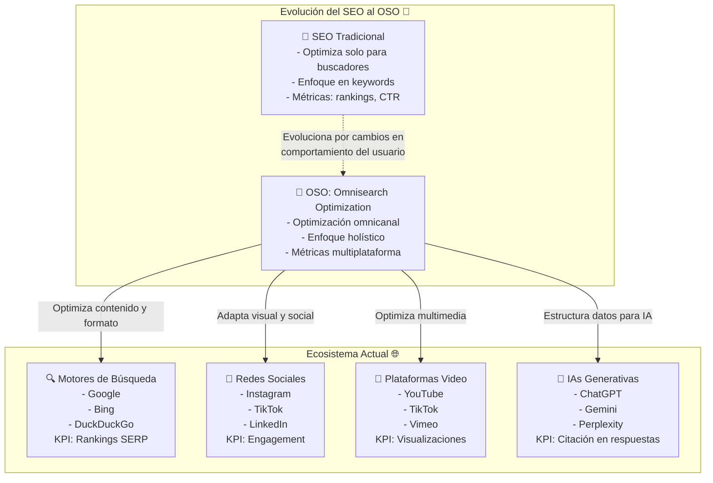
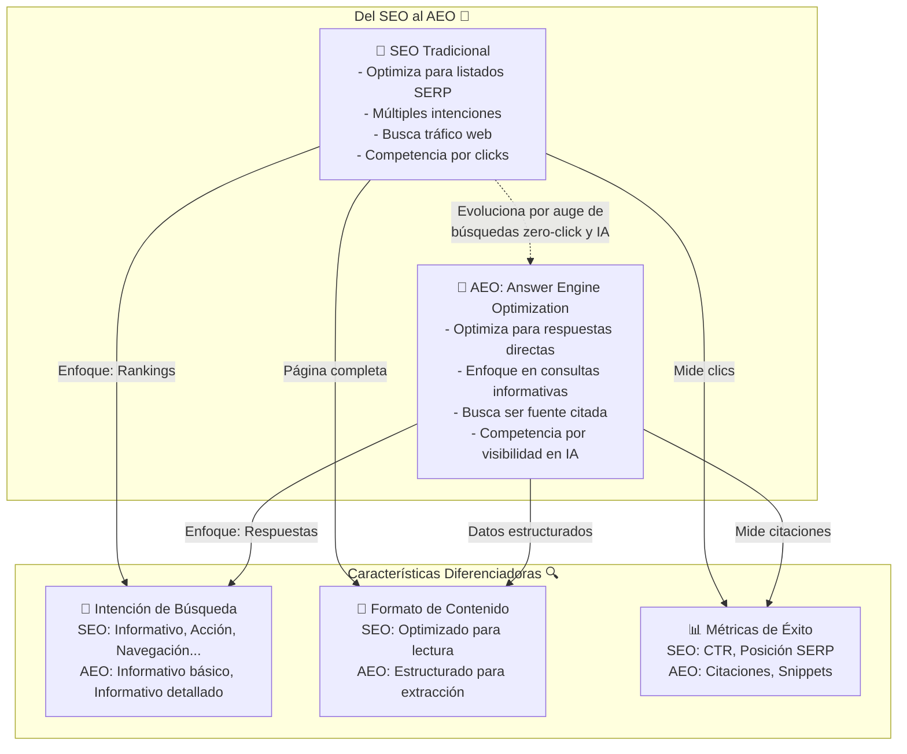
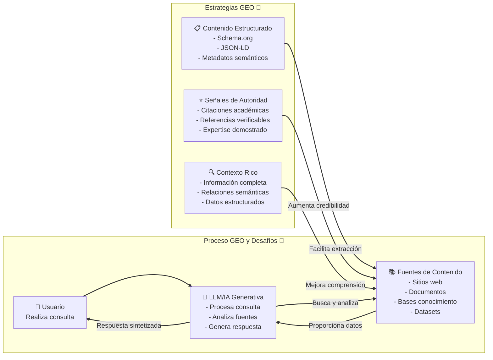
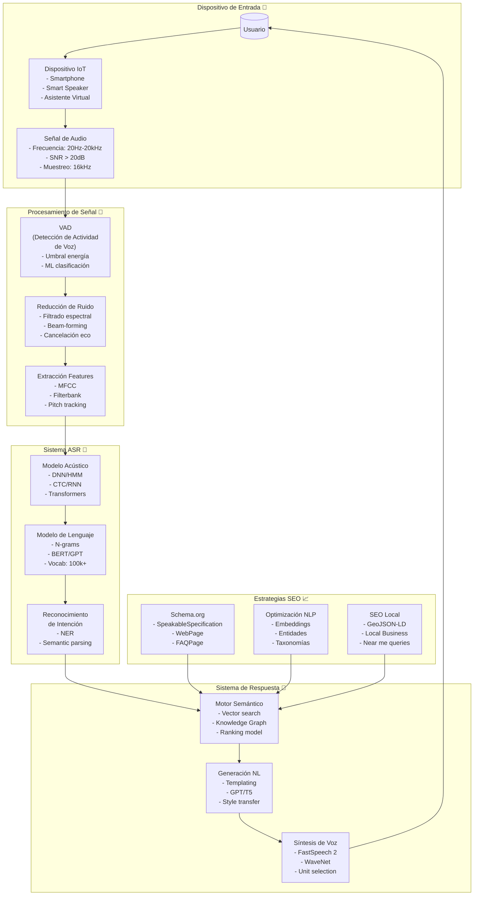
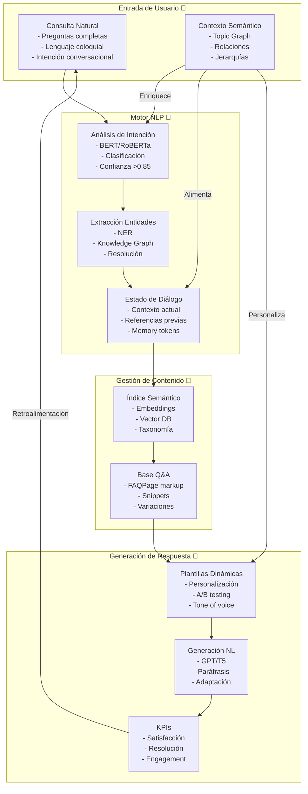
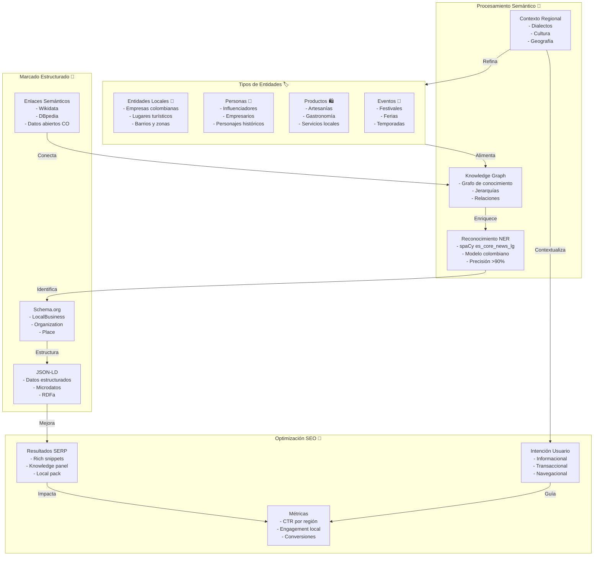

# 👋 ¡Hola! Soy Jovanny Medina Cifuentes

## 👨‍💻 Desarrollador de Software Backend

## 💼 Resumen Profesional

Actualemente desarrollo aplicaciones para empresas que integran  _(con ODBC)_ Picking, WooCommerce, Facturación Electrónica,  con arquitecturas cloud costo eficientes.

> En mis inicios _(hace más de 25 años)_, desarrollé una aplicación de escritorio para pedidos en MS Access + SQL Server: [InfoGAS] y la actualicé e implementé durante 9 años en los Call Center de empresas de GLP en Colombia (Colgas, Asogas, Unigas, Lidagas, Gas Norte, Doragas, Cocigas, etc.). [InfoGAS] Fue pionero en ennvío de pedidos inmediatos al vehículo de reparto con SMS _(con Avantel y luego a través de internet con datáfonos Verifone, que imprimía al instante el pedido)_ facilitando las entregas a menos de 1 hora _(en aquella época)_ en las principales ciudades de Colombia como Bogotá, Cali, Medellín, Manizales, Pereira, Florencia, Tunja, Apartadó, etc..

## 🌐 Experiencia Cloud - Actualmente

| Plataforma | Especialidades |
|------------|----------------|
| GCP | • App Check • Authentication • Cloud Firestore • Cloud Functions • Hosting • Realtime Database • Storage • Analytics |
| AWS | • Certificate Manager • CloudFront • S3 • IAM • Route 53 • RDS • EC2 (Amazon Linux 2023) • WordPress de Alta Disponibilidad |

## 💡 Competencias Técnicas

| Categoría | Habilidades |
|-----------|-------------|
| Backend | Node.js |
| Cloud | GCP, AWS, Serverless |
| Bases de Datos | • SQL Server _(World Office - Software Contable Colombiano)_ • MS Access AVANZADO + _VBA_ • Firestore • Firebase Realtime  • MySQL - MariaDB _(WordPress - WooCommerce)_ |
| Metodologías | Agile, Kanban |
| Control de versiones | GIT - GitHub |

## 🎓 Formación Continua

- Desarrollo backend avanzado
- Arquitecturas serverless
- Inteligencia Artificial aplicada

## 🤝 Colaboración

- Gestión de proyectos con GitHub Projects
- Comunicación efectiva con equipos multidisciplinarios
- Documentación técnica detallada
- Mentoría de programadores junior del SENA

## 🚴‍♂️ Más Allá del Código

Apasionado del ciclismo (ruta y MTB), encuentro en este deporte una fuente de inspiración para mantener un equilibrio entre la innovación tecnológica y el bienestar personal.

## 📞 Contacto

## 📈 Actividad en GitHub

| Estadística | Visualización |
|-------------|---------------|
| Lenguajes Más Usados |  |
| Trofeos |  |

# Complementando mi formación: más allá del SEO tradicional

Yo, Jovanny Medina Cifuentes, como desarrollador de software, he estado estudiando profundamente los cambios fundamentales que están transformando la visibilidad online. El auge de la IA generativa está revolucionando radicalmente cómo buscamos y consumimos información. A medida que más usuarios recurren a ChatGPT, Gemini y otras herramientas de IA para obtener respuestas directas, la dependencia de los motores de búsqueda tradicionales está evolucionando significativamente.

Esta transformación ha dado lugar a nuevos paradigmas de optimización que trascienden el SEO tradicional. Como desarrollador de software, necesito entender estos nuevos conceptos para garantizar la visibilidad del contenido tanto en búsquedas convencionales como en las basadas en inteligencia artificial de mis clientes (en especial los de WooCommerce).

## OSO: OmniSearch Optimization

La **Omnisearch Optimization (OSO)** representa una evolución significativa en nuestras estrategias de posicionamiento digital. No se trata simplemente de una actualización del SEO tradicional, sino de un enfoque integral que abarca todos los espacios digitales donde los usuarios buscan información.

### ¿Qué es OSO y por qué es importante?

OSO es una estrategia de posicionamiento digital que va más allá de los motores de búsqueda tradicionales. Mientras que el SEO se enfoca principalmente en optimizar páginas web para buscadores como Google y Bing, OSO adapta el contenido a diversos entornos digitales donde los usuarios buscan información. La diferencia fundamental es que OSO no se limita a optimizar para algoritmos de búsqueda específicos, sino que adopta un enfoque holístico para cada plataforma según sus particularidades.

He observado que este concepto ha surgido en respuesta al cambio significativo en el comportamiento de los usuarios. Hoy en día, las búsquedas no se limitan a Google; los consumidores buscan información en múltiples canales:

- **Redes sociales**: Instagram, TikTok y LinkedIn funcionan como motores de búsqueda para contenido visual, tendencias y conexiones profesionales.
- **Plataformas de video**: YouTube y TikTok son fundamentales para búsquedas de tutoriales y reseñas de productos.
- **Chats generativos**: Herramientas como ChatGPT, Perplexity y Gemini representan un nuevo espacio para posicionar contenido directo y conversacional.

### Implementación de OSO en una estrategia digital

Para implementar OSO eficazmente, he aprendido que es necesario analizar cada plataforma donde nuestra audiencia objetivo busca información y adaptar el contenido a los formatos adecuados para cada canal. Esto implica:

1. **Análisis de plataformas de búsqueda**: Comprender dónde y cómo los usuarios buscan información en el ecosistema digital. Por ejemplo, en Instagram, los usuarios buscan inspiración visual, mientras que en LinkedIn buscan contenido profesional y de networking.
2. **Optimización de contenido para cada plataforma**: Adaptar mensajes y formatos según las características específicas de cada medio. En TikTok, por ejemplo, el contenido debe ser breve, visualmente atractivo y optimizado para algoritmos de recomendación, mientras que en YouTube, los videos más largos y detallados pueden funcionar mejor.
3. **Experiencia del usuario**: Optimizar la navegación y facilitar el acceso a la información en cada canal. Esto puede incluir la creación de perfiles completos en redes sociales, la implementación de hashtags relevantes y la interacción activa con la comunidad.

**Ejemplo práctico**: Para un cliente de WooCommerce que vende artesanías colombianas, podríamos:
- Optimizar la tienda online para Google con SEO tradicional.
- Crear videos tutoriales en YouTube sobre cómo usar los productos.
- Publicar historias y reels en Instagram mostrando el proceso de creación.
- Utilizar ChatGPT para generar descripciones de productos que respondan a preguntas comunes de los usuarios.

## AEO: Answer Engine Optimization

Mientras OSO abarca todo el ecosistema de búsqueda, el **Answer Engine Optimization (AEO)** se centra específicamente en optimizar contenido para proporcionar respuestas directas a consultas de usuarios.

### ¿Qué es AEO y cómo difiere del SEO tradicional?

AEO es una estrategia avanzada de marketing digital que busca optimizar el contenido para que aparezca como respuesta directa a preguntas específicas de los usuarios en motores de respuesta basados en IA. A diferencia del SEO tradicional, que busca mejorar el posicionamiento general en resultados de búsqueda, AEO se especializa en aparecer como fuente para consultas directas y sencillas.

La principal diferencia entre SEO y AEO radica en su enfoque:

| SEO                          | AEO                          |
|------------------------------|------------------------------|
| Objetivo: Mejorar posicionamiento en las SERP | Objetivo: Aparecer como fuente para consultas directas |
| Recoge todas las intenciones de búsqueda | Se especializa en intenciones "Informativo básico" e "Informativo detallado" |
| Menos relevante en búsquedas sin clic | Muy relevante en búsquedas sin clic |
| Estrategia: Aumentar tráfico a largo plazo | Estrategia: Responder consultas de inmediato |

### El futuro del SEO es el AEO

He notado que la tendencia hacia búsquedas "zero-click" o sin clic, donde el usuario obtiene la respuesta directamente en la página de resultados sin necesidad de visitar un sitio web, está ganando terreno. Google está implementando avances basados en IA generativa como Search Generative Experience, permitiendo a los usuarios encontrar respuestas sin entrar en distintas webs.

Considerando que sobre el 25% de las interacciones entre individuos y tecnología se efectúan mediante la voz, y ante los millones de usuarios de asistentes vocales (incluidos aquellos basados en ChatGPT), la relevancia de la Optimización para Asistentes de Voz (AEO) en las estrategias de marketing digital se intensifica. Consecuentemente, resulta imperativo que el área de desarrollo backend se mantenga actualizada respecto a las nuevas buenas prácticas en la escritura del código destinado a la automatización de contenido.

**Métricas de éxito para AEO**:
- **Citaciones en respuestas de IA**: Monitorear cuántas veces nuestro contenido es citado por herramientas como ChatGPT o Gemini.
- **Apariciones en snippets**: Verificar si nuestro contenido aparece en los snippets destacados de Google.
- **Tasa de respuestas directas**: Medir la frecuencia con la que nuestro contenido proporciona respuestas directas a consultas específicas.

## GEO: Generative Engine Optimization

El concepto de **Generative Engine Optimization (GEO)** representa otro paradigma emergente en el ámbito de la visibilidad para inteligencias artificiales.

### ¿Qué es GEO?

GEO se refiere a la optimización para motores generativos, que son aquellos que utilizan grandes modelos de lenguaje para recopilar y resumir información de múltiples fuentes para responder consultas de usuarios. Este enfoque reconoce que los motores de búsqueda generativos están rápidamente reemplazando a los tradicionales, presentando tanto oportunidades como desafíos para los creadores de contenido.

El principal desafío que aborda GEO es garantizar que los creadores de contenido mantengan visibilidad en las respuestas generadas por IA, dado que estos sistemas a menudo sintetizan información de múltiples fuentes sin proporcionar enlaces directos o visibilidad clara a los sitios originales.

**Estrategias específicas para GEO**:
1. **Contenido estructurado**: Utilizar Schema.org y JSON-LD para que las IA puedan extraer y comprender fácilmente la información.
2. **Señales de autoridad**: Incluir citas académicas, referencias verificables y demostrar expertise en el tema.
3. **Contexto rico**: Proporcionar información completa y detallada, estableciendo relaciones semánticas claras entre conceptos.

## Estrategias complementarias para optimización en IA

Además de los conceptos principales, he estudiado estrategias complementarias que mejoran la visibilidad para inteligencias artificiales:

### Optimización para búsqueda por voz

La búsqueda por voz ha evolucionado para convertirse en un componente crucial de la optimización para buscadores, especialmente con el aumento en el uso de asistentes virtuales y dispositivos inteligentes. Este proceso implica múltiples capas de procesamiento y optimización:

1. **Entrada de voz**: El usuario realiza una consulta utilizando lenguaje natural, a menudo en forma de preguntas completas y frases conversacionales.
2. **Procesamiento de voz**: La consulta de voz es convertida a texto mediante sistemas de Reconocimiento Automático del Habla (ASR). Luego, el Procesamiento de Lenguaje Natural (NLP) analiza la consulta para entender la intención del usuario, el contexto y las entidades mencionadas.
3. **Optimización para búsqueda por voz**:
   - **Keywords**: Uso de palabras clave de cola larga, preguntas completas y frases naturales que los usuarios podrían hablar.
   - **Contenido**: Creación de contenido que ofrezca respuestas directas, estructurado en formato de preguntas y respuestas (FAQ) y que utilice datos estructurados para facilitar la comprensión por parte de las IA.
   - **SEO Local**: Implementación de rich snippets, schema markup e información geolocalizada para consultas locales.
4. **Entrega de respuesta**: El motor de búsqueda devuelve una respuesta concisa, relevante y contextualizada, que es luego convertida a salida de voz para el usuario.

### Conversational SEO

El Conversational SEO implica optimizar contenido para consultas naturales y humanas, incluyendo preguntas completas y frases detalladas que reflejan la comunicación real. Este enfoque aborda la creciente popularidad de asistentes virtuales y chatbots impulsados por IA.

Para implementarlo eficazmente, me he centrado en:
- Enfocarme en palabras clave de cola larga naturales.
- Crear contenido estructurado en formato de preguntas y respuestas.
- Priorizar la intención genuina del usuario.

**Ejemplo práctico**: Para un cliente de WooCommerce, podríamos crear una sección de preguntas frecuentes (FAQ) en la página de cada producto, respondiendo a preguntas comunes como "¿Cuánto tiempo tarda en llegar el pedido?" o "¿Cuál es la política de devoluciones?". Esto no solo mejora la experiencia del usuario, sino que también aumenta las posibilidades de que nuestro contenido sea seleccionado por las IA para respuestas directas.

### Entity-Based SEO

El SEO basado en entidades se centra en el concepto de entidades como elemento central, en lugar de basarse únicamente en palabras clave. Una entidad puede ser cualquier elemento único y bien definido, como una persona, lugar, organización o concepto.

Este enfoque es particularmente relevante para la IA, ya que las inteligencias artificiales intentan comprender relaciones contextuales entre entidades para proporcionar respuestas más precisas. En mi implementación incluyo:
- Identificación clara de entidades relevantes en el contenido.
- Establecimiento de relaciones contextuales entre entidades.
- Uso de datos estructurados para ayudar a los buscadores a comprender entidades y sus relaciones.

**Ejemplo práctico**: Para una tienda WooCommerce de artesanías, podríamos usar Schema.org para marcar entidades como "Producto", "Artesano" y "Región", estableciendo relaciones como "hecho por" o "originario de". Esto ayuda a las IA a entender y conectar mejor la información, mejorando la visibilidad en búsquedas relacionadas.

## Estrategias prácticas para aumentar la visibilidad en IA

Para maximizar la visibilidad de nuestro contenido para inteligencias artificiales, considero estas estrategias prácticas fundamentales:

### 1. Estructurar el contenido para facilitar la extracción

Las IA tienden a favorecer contenido bien estructurado que facilite la extracción de información. Para ello:
- Utilizo encabezados jerárquicos claros (H1, H2, H3).
- Organizo información en listas o tablas cuando es apropiado.
- Incluyo un resumen o conclusión clara al final de cada sección importante.

### 2. Implementar datos estructurados

Los datos estructurados y el marcado de esquema son críticos para permitir que las inteligencias artificiales comprendan mejor el contenido:
- Utilizo schema.org para implementar marcado de esquema.
- Agrego marcado específico para secciones como FAQs, productos y reseñas.
- Mantengo los datos estructurados actualizados y precisos.

### 3. Optimizar para intención y contexto

Las IA modernas están diseñadas para comprender la intención detrás de las consultas. Para optimizar este aspecto:
- Investigo y comprendo las preguntas que nuestra audiencia hace.
- Adapto el contenido para responder precisamente a esas necesidades.
- Utilizo un lenguaje claro y directo que responda a la intención del usuario.

### 4. Crear contenido de alta calidad y autoridad

Las inteligencias artificiales están cada vez más capacitadas para evaluar la calidad y autoridad del contenido:
- Desarrollo contenido exhaustivo y bien investigado.
- Cito fuentes confiables.
- Mantengo el contenido actualizado con la información más reciente.
- Construyo autoridad temática con contenido relacionado e interconectado.

## Conclusión: Adaptación a un futuro impulsado por la IA

En mi experiencia, la evolución de la búsqueda de información está cambiando fundamentalmente con la integración de inteligencias artificiales en nuestras herramientas digitales cotidianas. Los conceptos de OSO, AEO y GEO representan nuevos paradigmas de optimización que responden a este cambio, yendo más allá del SEO tradicional para garantizar que nuestro contenido sea visible no solo en motores de búsqueda convencionales, sino también en el amplio ecosistema digital donde las personas y las IA buscan información.

Para nosotros como creadores de contenido y profesionales del marketing, la adaptación a estos nuevos paradigmas no implica abandonar el SEO tradicional, sino complementarlo con estas estrategias emergentes. La clave está en crear contenido de alta calidad, bien estructurado, que responda directamente a las preguntas de los usuarios y que esté optimizado para múltiples plataformas digitales.

Las inteligencias artificiales juegan un papel cada vez más prominente en la creación y distribución de información. Entender y aplicar estos conceptos nos permite estar mejor posicionados para mantener y aumentar nuestra visibilidad digital, independientemente de cómo evolucionen las tecnologías de búsqueda.

**Llamado a la acción**: Si eres un desarrollador, profesional del marketing o creador de contenido, te invito a empezar a implementar estas estrategias en tus proyectos. Comienza por analizar dónde busca información tu audiencia y adapta tu contenido a esos canales. Experimenta con datos estructurados y optimiza para respuestas directas. El futuro de la visibilidad online está aquí, y es impulsado por la IA.
